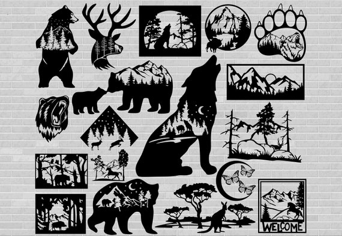
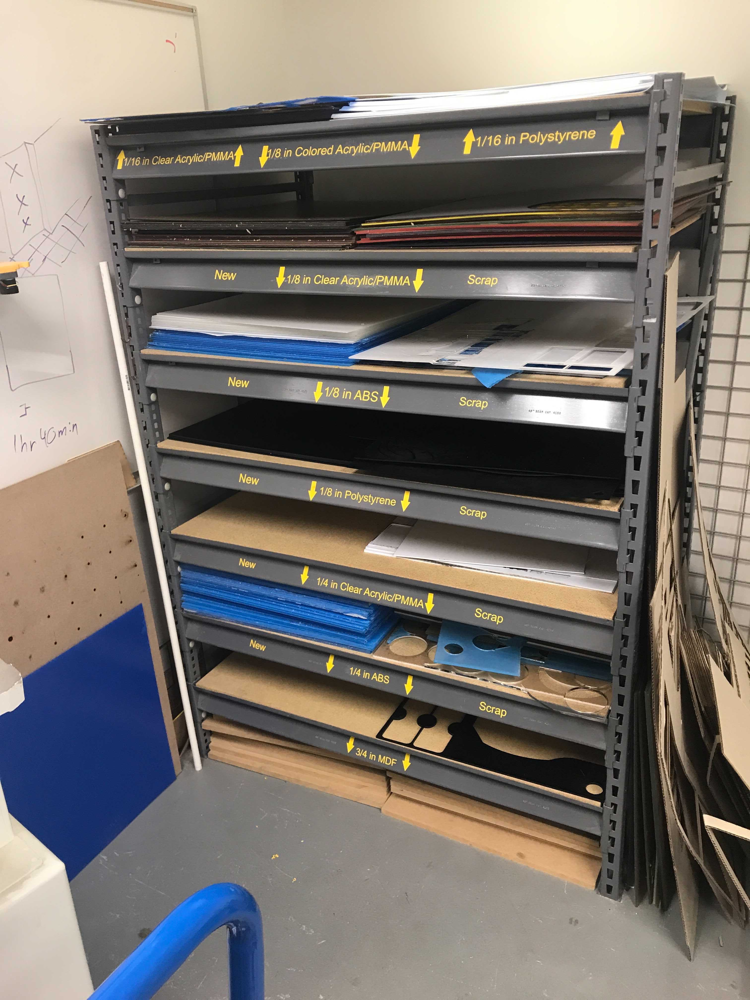
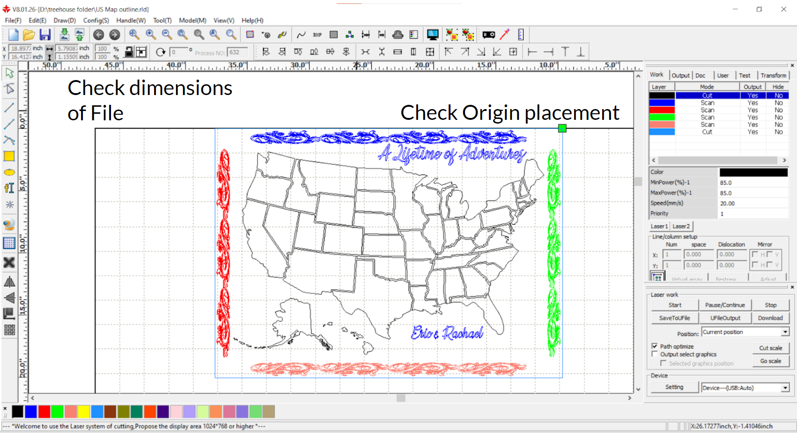

# How to Use a Laser Cutter:
## _The Ones in the Makerspace_
Laser cutters are a type of nontraditional subtractive manufacturing technology. This technology allows for two-dimensional shapes to be cut out of various materials. Potential applications are abundant, but bad things can happen if mishandled. Cuts and engravings can be done to materials with these lasers via DXF files.

***

## What is a DXF file?
A DXF file is a CAD (computer-aided design) vector image, silhouette images are the best showcase.

  

The lasers in the makerspace only take DXF files, but other file types can be converted to DXF files with external software, like CorelDraw and Convertio.

***

## Warnings: ⚠️ 🛑 
### _Lasers can be harmful to the skin, DO NOT TOUCH IT_ 

  

  
### Someone else needs to be in the room during operation in case something goes wrong

***

## Materials:
- The lasers in the makerspace can only cut up to 1/4 inch thick material 
- Thicker materials are to be cut with the XCarve, also in the makerspace
  - Materials Provided (1/8 inch and 1/4 inch):
    - Plywood
    - Hardboard
    - MDF (Medium-density fibreboard)
    - Various Acrylics
    - Cardboard 
- The size of the material cannot be bigger than 32 inches wide by 24 inches tall
  

  

A shelf in the makerspace with some of the different provided materials

***

## Steps:
1) Import your DXF file to the RDWorks software that is on the computer next to the laser cutters 
2) Place the DXF graphic close to the top right (green square origin), photo example below
3) Split portions of the graphic into separate colors and choose different cut modes:
- Each color has individual set parameter by the user
- Scan (engraving) or cut (vector or raster)
  - Ideally order scans first then cuts, so the material does not become out of focus

4) Look around for power/speed charts for different materials in the space, helps visualize 
- 1/8 inch plywood is the reference here
  - For “cut” colors the power should be around 85 power and 25 mm/s speed to punch through
  - For "cut" (vector engravings) a power around 15 and 375 mm/s speed will work (outlining)
  - For “scan” the power levels can be anywhere around 50 and about 450 mm/s speed
    - lower power for a lighter engraving and higher power for a darker engraving

  

  
5) Power on the laser with the key, lights should flash and a noise will be produced

6) Lift the lid and place the material on the grate
- Avoid hitting the laser with the material

7) Autofocus the laser on the material
- Move the laser above the material: hit Z/U, autofocus
  - Needs done everytime a new material is used

8) Once satisfied download the cut profile to the connected laser cutter
- A few questions will pop up on RDworks
  - Leave as "default"
  - Duplicate hit yes

9) With the file transferred to the laser: hit file, default, enter
- You should see the colored profiles on the laser’s screen 
- If everything is not there, check to see if portions are labeled "Yes" under output on RDworks
  - The preview button on RDworks can help double check everything looks correct

10) Hit origin for your graphic's start on the material

11) Hit frame to show the size of the cut area
- If satisfied:
  - Place magnets on the material and out of the path of the laser, if possible
  - Hit Start/Pause, wait five seconds, then hit enter
- If not satisfied:
  - Resize graphic on RDworks, then repeat steps 8-11

12) Laser begins, wait till cut is done to get final piece, clean up afterwards

It takes time to get attuned to the different settings, practice and time is key, any questions?
